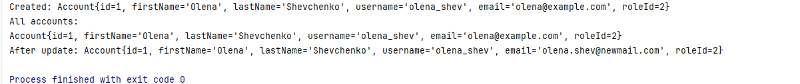
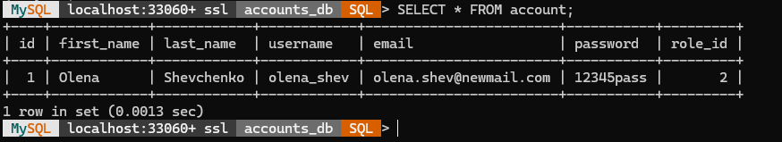

# Accounts DB Project

Цей документ докладно пояснює всі кроки від **ініціалізації бази даних** до **запуску Java-аплікації**, яка працює з таблицею `account` через DAO (Data Access Object) патерн.

---

## 1. Структура проєкту

```
accounts-db-project/
├── sql/
│   └── create_accounts_db.sql      # SQL-скрипт для створення БД і таблиці
└── src/
    └── com/
        └── example/
            ├── util/
            │   └── DatabaseConnection.java   # Клас для управління JDBC-з’єднанням
            ├── model/
            │   └── Account.java              # POJO-модель для рядка таблиці
            ├── dao/
            │   ├── AccountDAO.java           # Інтерфейс CRUD-операцій
            │   └── AccountDAOImpl.java       # Реалізація DAO через JDBC
            └── Main.java                     # Приклад використання DAO
```

> **Чому так?**  
> - **sql/**: ізольований скрипт допомагає швидко ініціалізувати БД незалежно від коду.  
> - **util/**: приховує деталі роботи з JDBC, даючи єдину точку зміни параметрів підключення.  
> - **model/**: POJO забезпечує відокремлення даних від бізнес-логіки.  
> - **dao/**: чітке розділення контракту (інтерфейсу) і реалізації надає гнучкість для заміни механізму збереження (наприклад, Hibernate замість прямого JDBC).

---

## 2. SQL: Ініціалізація бази

**Файл:** `sql/create_accounts_db.sql`

```sql
-- 1) Створення схеми (якщо її немає)
CREATE DATABASE IF NOT EXISTS accounts_db;

-- 2) Перемикання контексту на нашу БД
USE accounts_db;

-- 3) Визначення структури таблиці account
CREATE TABLE IF NOT EXISTS account (
  id INT AUTO_INCREMENT PRIMARY KEY,       -- Унікальний ключ, автоінкремент
  first_name VARCHAR(255),                -- Ім’я користувача
  last_name VARCHAR(255),                 -- Прізвище користувача
  username VARCHAR(255) NOT NULL UNIQUE,  -- Логін (унікальний)
  email VARCHAR(255) NOT NULL UNIQUE,     -- Email (унікальний)
  password VARCHAR(255) NOT NULL,         -- Хеш пароля
  role_id INT                             -- Логічне посилання на роль (без FK)
);
```

> **Пояснення**  
> - `AUTO_INCREMENT`: автоматичне збільшення `id` при вставці.  
> - `UNIQUE`: гарантує відсутність повторів для логіна та email.  
> - Таблиця **автономна**, без зовнішніх ключів — зручно для демонстрацій і тестів.

---

## 3. Параметри підключення

**Файл:** `src/com/example/util/DatabaseConnection.java`

```java
package com.example.util;

import java.sql.Connection;
import java.sql.DriverManager;
import java.sql.SQLException;

/**
 * Одноразовий (singleton) клас для отримання JDBC-з’єднання.
 * Спрощує управління ресурсами і дозволяє змінювати налаштування підключення в одному місці.
 */
public class DatabaseConnection {
    private static final String URL  =
        "jdbc:mysql://localhost:3306/accounts_db?useSSL=false&serverTimezone=UTC";
    private static final String USER = "root";
    private static final String PASS = "your_password_here";

    private static Connection conn;

    private DatabaseConnection() { }

    /**
     * Повертає єдине з’єднання з базою.
     * Якщо з’єднання не існує або закрите — створює нове.
     */
    public static Connection getConnection() throws SQLException {
        if (conn == null || conn.isClosed()) {
            conn = DriverManager.getConnection(URL, USER, PASS);
        }
        return conn;
    }
}
```

> **Поради**  
> - Для продакшн-систем робіть пул з’єднань (HikariCP, Apache DBCP).  
> - Не зберігайте пароль у коді — використовуйте змінні оточення.

---

##  4. POJO: Account.java

**Файл:** `src/com/example/model/Account.java`

```java
package com.example.model;

/**
 * Модель об’єкта Account, яка відповідає таблиці account.
 * Використовується для передачі даних між DAO і бізнес-логікою.
 */
public class Account {
    private int id;
    private String firstName;
    private String lastName;
    private String username;
    private String email;
    private String password;
    private int roleId;

    public Account() { }

    // Конструктор для створення нового запису
    public Account(String firstName, String lastName,
                   String username, String email,
                   String password, int roleId) {
        this.firstName = firstName;
        this.lastName  = lastName;
        this.username  = username;
        this.email     = email;
        this.password  = password;
        this.roleId    = roleId;
    }

    // Конструктор для читання з бази (включно з id)
    public Account(int id, String firstName, String lastName,
                   String username, String email,
                   String password, int roleId) {
        this(firstName, lastName, username, email, password, roleId);
        this.id = id;
    }

    // Геттери і сеттери для всіх полів
    // ...

    @Override
    public String toString() {
        return "Account{" +
               "id=" + id +
               ", firstName='" + firstName + ''' +
               ", lastName='" + lastName + ''' +
               ", username='" + username + ''' +
               ", email='" + email + ''' +
               ", roleId=" + roleId +
               '}';
    }
}
```

> **Чому POJO?**  
> - Легко тестувати.  
> - Не залежить від конкретного фреймворку.

---

## 5. DAO-шари

### 5.1. Інтерфейс AccountDAO

**Файл:** `src/com/example/dao/AccountDAO.java`

```java
package com.example.dao;

import com.example.model.Account;
import java.sql.SQLException;
import java.util.List;

/**
 * Контракт CRUD-операцій з таблицею account.
 */
public interface AccountDAO {
    void addAccount(Account a) throws SQLException;
    Account getAccountById(int id) throws SQLException;
    List<Account> getAllAccounts() throws SQLException;
    void updateAccount(Account a) throws SQLException;
    void deleteAccount(int id) throws SQLException;
}
```

### 5.2. Реалізація

**Файл:** `src/com/example/dao/AccountDAOImpl.java`

```java
package com.example.dao;

import com.example.model.Account;
import com.example.util.DatabaseConnection;

import java.sql.*;
import java.util.ArrayList;
import java.util.List;

/**
 * Реалізація AccountDAO за допомогою прямого JDBC.
 */
public class AccountDAOImpl implements AccountDAO {
    private final Connection conn;

    public AccountDAOImpl() throws SQLException {
        this.conn = DatabaseConnection.getConnection();
    }

    @Override
    public void addAccount(Account a) throws SQLException {
        String sql = "INSERT INTO account " +
                     "(first_name,last_name,username,email,password,role_id) VALUES (?,?,?,?,?,?)";
        try (PreparedStatement ps = conn.prepareStatement(
                sql, Statement.RETURN_GENERATED_KEYS)) {
            ps.setString(1, a.getFirstName());
            ps.setString(2, a.getLastName());
            ps.setString(3, a.getUsername());
            ps.setString(4, a.getEmail());
            ps.setString(5, a.getPassword());
            ps.setInt(6, a.getRoleId());
            ps.executeUpdate();
            // Отримуємо згенерований PK
            try (ResultSet rs = ps.getGeneratedKeys()) {
                if (rs.next()) {
                    a.setId(rs.getInt(1));
                }
            }
        }
    }

    @Override
    public Account getAccountById(int id) throws SQLException {
        String sql = "SELECT * FROM account WHERE id = ?";
        try (PreparedStatement ps = conn.prepareStatement(sql)) {
            ps.setInt(1, id);
            try (ResultSet rs = ps.executeQuery()) {
                if (rs.next()) {
                    return new Account(
                        rs.getInt("id"),
                        rs.getString("first_name"),
                        rs.getString("last_name"),
                        rs.getString("username"),
                        rs.getString("email"),
                        rs.getString("password"),
                        rs.getInt("role_id")
                    );
                }
            }
        }
        return null;
    }

    @Override
    public List<Account> getAllAccounts() throws SQLException {
        List<Account> list = new ArrayList<>();
        String sql = "SELECT * FROM account";
        try (Statement st = conn.createStatement();
             ResultSet rs = st.executeQuery(sql)) {
            while (rs.next()) {
                list.add(new Account(
                    rs.getInt("id"),
                    rs.getString("first_name"),
                    rs.getString("last_name"),
                    rs.getString("username"),
                    rs.getString("email"),
                    rs.getString("password"),
                    rs.getInt("role_id")
                ));
            }
        }
        return list;
    }

    @Override
    public void updateAccount(Account a) throws SQLException {
        String sql = "UPDATE account SET first_name=?, last_name=?, username=?, " +
                     "email=?, password=?, role_id=? WHERE id=?";
        try (PreparedStatement ps = conn.prepareStatement(sql)) {
            ps.setString(1, a.getFirstName());
            ps.setString(2, a.getLastName());
            ps.setString(3, a.getUsername());
            ps.setString(4, a.getEmail());
            ps.setString(5, a.getPassword());
            ps.setInt(6, a.getRoleId());
            ps.setInt(7, a.getId());
            ps.executeUpdate();
        }
    }

    @Override
    public void deleteAccount(int id) throws SQLException {
        try (PreparedStatement ps = conn.prepareStatement(
                "DELETE FROM account WHERE id=?")) {
            ps.setInt(1, id);
            ps.executeUpdate();
        }
    }
}
```

---

## 6. Main.java

**Файл:** `src/com/example/Main.java`

```java
package com.example;

import com.example.dao.AccountDAO;
import com.example.dao.AccountDAOImpl;
import com.example.model.Account;

import java.sql.SQLException;
import java.util.List;

/**
 * Демонстрація CRUD-операцій над таблицею account.
 */
public class Main {
    public static void main(String[] args) {
        try {
            AccountDAO dao = new AccountDAOImpl();

            // CREATE: додаємо запис
            Account a = new Account("Olena", "Shevchenko",
                                    "olena_shev", "olena@example.com",
                                    "pass123", 2);
            dao.addAccount(a);
            System.out.println("Created: " + a);

            // READ: всі записи
            List<Account> all = dao.getAllAccounts();
            all.forEach(System.out::println);

            // UPDATE: міняємо email
            a.setEmail("olena.shev@newmail.com");
            dao.updateAccount(a);
            System.out.println("After update: " + dao.getAccountById(a.getId()));

            // DELETE: видаляємо запис
            dao.deleteAccount(a.getId());
            System.out.println("After delete:");
            dao.getAllAccounts().forEach(System.out::println);

        } catch (SQLException ex) {
            ex.printStackTrace();
        }
    }
}
```

---

## Результати

**Результат у JAVA**



**Результат у Shell**


